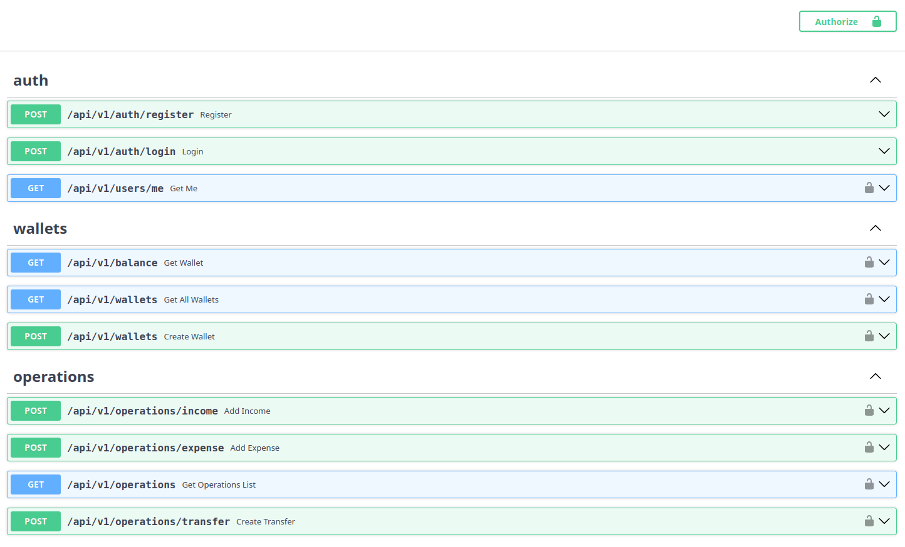

# Finance Tracker API

REST API для управления личными финансами и мультивалютными кошельками.  
Проект разработан на FastAPI с использованием PostgreSQL, Docker, JWT-аутентификации и GitHub Actions CI.


---

## Функционал

- JWT-аутентификация
- Управление кошельками
- Пополнение и списание средств
- Переводы между кошельками
- Поддержка нескольких валют (USD, EUR, KZT)
- Конвертация валют через внешний API
- История операций с фильтрацией
- Пагинация
- Логирование
- Alembic миграции
- Автоматические тесты с Pytest
- Docker-поддержка
- GitHub Actions CI pipeline

---

## Стек технологий

- Python 3.12
- FastAPI
- PostgreSQL
- SQLAlchemy
- Alembic
- Pydantic v2
- JWT (python-jose)
- Docker & Docker Compose
- Pytest
- GitHub Actions
- httpx

---

## Архитектура проекта

Проект построен с разделением на слои:

```text
app/
├── api/          # Роутеры и эндпоинты
├── repository/   # Работа с базой данных
├── service/      # Бизнес-логика
├── models.py     # SQLAlchemy модели
├── schemas.py    # Pydantic схемы
├── database.py   # Конфигурация базы данных
```

---

## API эндпоинты

### Авторизация

| Метод | Endpoint | Описание |
|---|---|---|
| POST | `/api/v1/auth/register` | Регистрация пользователя |
| POST | `/api/v1/auth/login` | Авторизация пользователя |
| GET | `/api/v1/users/me` | Получить текущего пользователя |

### Кошельки

| Метод | Endpoint | Описание |
|---|---|---|
| GET | `/api/v1/balance` | Получить общий баланс |
| GET | `/api/v1/wallets` | Получить список кошельков |
| POST | `/api/v1/wallets` | Создать кошелёк |

### Операции

| Метод | Endpoint | Описание |
|---|---|---|
| POST | `/api/v1/operations/income` | Пополнение кошелька |
| POST | `/api/v1/operations/expense` | Списание средств |
| POST | `/api/v1/operations/transfer` | Перевод между кошельками |
| GET | `/api/v1/operations/operations` | История операций |

---

## Swagger UI

### Документация API

```text
http://localhost:8000/docs
```

### Скриншот документации



---

## Запуск через Docker

### 1. Клонировать репозиторий

```bash
git clone https://github.com/AlikhanBirzhan/finance-tracker-api
cd finance-tracker-api
```

---

### 2. Создать `.env`

```env
POSTGRES_DB=finance_tracker
POSTGRES_USER=postgres
POSTGRES_PASSWORD=postgres

DATABASE_URL=postgresql+asyncpg://postgres:postgres@db:5432/finance_tracker

SECRET_KEY=your_secret_key
ALGORITHM=HS256
ACCESS_TOKEN_EXPIRE_MINUTES=30
```

---

### 3. Запустить контейнеры

```bash
docker compose up --build
```

Swagger UI будет доступно по адресу:

```text
http://localhost:8000/docs
```

---

## Миграции базы данных

Применить миграции:

```bash
alembic upgrade head
```

Создать новую миграцию:

```bash
alembic revision --autogenerate -m "migration_name"
```

---

## Запуск тестов

```bash
pytest -v
```

Тесты включают:
- тесты авторизации
- тесты операций

---

## CI Pipeline

GitHub Actions автоматически:
- устанавливает зависимости
- запускает тесты
- проверяет проект при push и pull request

---

## Логирование

В проекте используется встроенный модуль logging для:
- логирования запуска и остановки приложения
- отслеживания обработки запросов
- логирования ошибок

---
